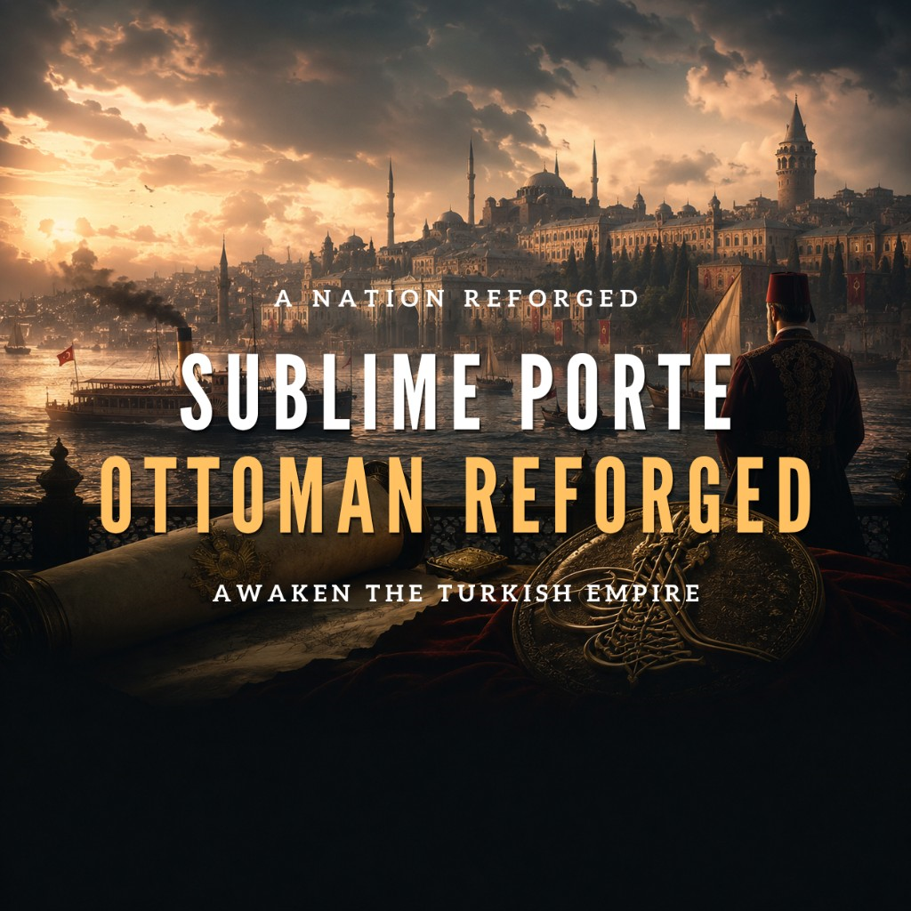

  

# Sublime Porte: Ottoman Reforged

A vanilla-first Ottoman campaign for **Victoria 3**. The 1836 empire is more historically grounded, the Tanzimat is something you can actually steer, and the late game opens three identities — Ottomanism, Islamism, or Turkism — without handing you a free great power.

Strength still has to be earned through reform, investment, politics, diplomacy, time, and opportunity cost.

## What you play

- **Campaign Tree.** A sidebar map of the Ottoman century: Tanzimat → the Constitutional Question → Three Policies. Ottomanism, Islamism, and Turkism sit on that tree with live requirements, so you can see where the campaign is going.
- **Tanzimat and the Sick Man.** Clearer objectives (finances, literacy, secession, army, administration). Optional one-shot decrees — cizye, çiftlik, maarif, the slave market — spend treasury and political capital instead of waiting for the journal to tick. Success is a limited rejuvenation plus one specialization. Failure stays severe and no longer kills the ruler.
- **Learning from Europe.** Send students, officers, technicians, and educators to France, Britain, Prussia/Germany, or Austria. Pick a primary partner, absorb complications, and later call on expertise such as von der Goltz. Capacity is scarce; you cannot run every mission at once.
- **After Tanzimat.** Young Ottomans, the Kanun-i Esasi, or a palace path: the constitutional question has to close before the three policies unlock. No scripted 1908 railroad.

## Three late-game identities

- **Ottomanism.** Equality, press, franchise, and a constitutional empire. No conquest tree: the reward is a harder, more coherent country.
- **Islamism.** Caliphate, Arabia, the Nile and Maghreb, then a protector of Muslim states. The Caliph can call for support — not a forced holy war. Ends as a Great Caliphate on the Ottoman tag.
- **Turkism and the Turanian Ideal.** A long, staged claim path across the Turkic world. You may remain the Ottoman Empire or proclaim the Great Ottoman Empire (name, color, and flag). The country is never renamed Turan. Turkic cultures already share a kinship tradition from 1836.

## 1836, diplomacy, and the provinces

- **Opening setup.** Owner-aware population (vanilla total kept), revised resource potential and starting buildings, a documented four-army order of battle, nineteenth-century names, and corrected commanders. No Anatolian tea plantations; unused deposits are not free factories.
- **Eastern Question.** Egypt can end in a limited Levant settlement, a costly maximalist victory, or a stalemate. Hünkâr İskelesi is an opening Russian guarantee that lapses; Baltalimanı is a real 1838 trade choice. Great Powers do not casually join Mehmed Ali’s side.
- **Şark Meselesi.** Russia presses the Orthodox question, mid-century protectorship, and later eastern reform. Pressure and prestige — not a scripted Crimean War.
- **Rumelia.** Guidance for reform, order, or compromise with existing subjects. The Great Eastern Crisis stays National Awakening content when that DLC is on; this mod fixes Ottoman/Balkan scope.
- **The rest of the empire.** Kurdish emirates and Bedirhan; an Armenian Question journal after Berlin; Tripoli, Tunis, and an Aden alarm; timed muhacir waves from Crimea, the Caucasus, and Rumelia that cost treasury rather than gift manpower.

## Court, companies, and flavor

- **Topkapı and Dolmabahçe.** Start in the old palace, build Dolmabahçe, move the court, optionally turn Topkapı into a museum.
- **Everyday Porte.** Schools, telegraph, press, advisers, railways, petitions, ports, and translation — quiet years still feel Ottoman.
- **People.** Âlî, Fuad, Ahmed Cevdet, and Nâmık Kemal; later Fevzi Çakmak, Mustafa Kemal, and Kâzım Karabekir. Enver stays vanilla Voice of the People content.
- **Şirket-i Hayriye** on the Bosphorus; a one-shot **Bank-ı Osmanî-i Şahane** concession (cheaper credit vs keeping the treasury in Ottoman hands).
- **Music.** Five original mood tracks composed for this mod, in the music player while you play as the empire.

English and Turkish are both complete.

## Requirements

- **Victoria 3:** `1.13.*` (tested on `1.13.11`)
- **Required mods:**
  - [Community Mod Framework](https://github.com/Victoria-3-Modding-Co-op/Community-Mod-Framework)
  - [Community State Framework](https://github.com/Victoria-3-Modding-Co-op/Community-State-Framework)
- **Load order:** Community Mod Framework → Community State Framework → Sublime Porte: Ottoman Reforged

National Awakening is **not** required. With the DLC off, the campaign still runs; Great Eastern Crisis journal content simply does not appear. Voice of the People and Sphere of Influence are also optional.

## Installation

- **Steam Workshop:** [Sublime Porte: Ottoman Reforged](https://steamcommunity.com/sharedfiles/filedetails/?id=3792636720)
- **Manual:** copy this folder into `Documents/Paradox Interactive/Victoria 3/mod/`

Then:

1. Install Community Mod Framework and Community State Framework.
2. Enable this mod in the launcher.
3. Confirm the load order above.
4. Start a **new game** as the Ottoman Empire.

Do not enable a local copy and a Workshop subscription of the same mod at the same time.

## Bug reports

Use GitHub Issues (sign in required). Pick **Bug report** or **Hata bildirimi** and fill the form:

https://github.com/oguzhanaslan/mod-sublime-porte-ottoman-reforged/issues/new/choose

Please do not open issues for vanilla Victoria 3 bugs, other mods, or an old save that never had this mod at 1836.

## Compatibility

- No `replace_path`.
- Narrow replacements only where vanilla has no additive hook (selected Tanzimat/Sick Man/Great Eastern Crisis definitions, Turkish names, and Ottoman history files).
- Other mods that edit Ottoman population, buildings, state regions, military formations, characters, Tanzimat, or the Great Eastern Crisis can conflict. Place this mod after CMF/CSF.

## Saves

The 1836 demographic, resource, building, naming, commander, and military setup is **new-game only**. Installing the mod into an existing save will not rebuild history.

Some later events can appear on an already-running Ottoman campaign. Mid-crisis or late-install behavior is otherwise unsupported.

## Languages

English is the source language. Turkish is fully supported and kept in key parity with English.

## License

See [LICENSE](LICENSE). Original Sublime Porte work may be reused for non-commercial Victoria 3 modding with attribution. Victoria 3 remains Paradox Interactive’s.

---

## Türkçe

Vanilla’yı temel alan bir Osmanlı kampanyası: 1836 daha sağlam, Tanzimat yönetilebilir, geç oyun Osmanlıcılık / İslamcılık / Türkçülük açar — bedava büyük güç vermez.

**Kampanya Ağacı** kenar çubuğundan Tanzimat → Meşrutiyet Meselesi → Üç Tarz-ı Siyaset’i izlersiniz. Tanzimat’ta maliye, okuryazarlık, ayrılık, ordu ve idare hedefleri nettir; isteğe bağlı fermanlar (cizye, çiftlik, maarif, esir pazarı) hazine ve siyaset harcar. **Avrupa’dan Öğrenmek** ile talebe, subay ve uzman gönderirsiniz. Tanzimat sonrası Yeni Osmanlılar, Kanun-i Esasi veya saray yolu gelir; üç siyaset ancak meşrutiyet meselesi kapanınca açılır.

**Osmanlıcılık** eşitlik ve anayasal imparatorluk (fetih ağacı yok). **İslamcılık** hilafet, Arabistan, Nil–Mağrip ve Halife’nin çağrısı; Büyük Hilafet Osmanlı etiketi üzerinde kalır. **Türkçülük / Turan Ülküsü** kademeli hak iddiası; Osmanlı kalabilir veya Büyük Osmanlı ilan edilebilir — ülke asla Turan adını almaz.

Mısır bunalımı, Hünkâr İskelesi, Baltalimanı, Rusya’nın Şark Meselesi baskısı, Rumeli, Bedirhan, Ermeni Meselesi, Trablus–Tunus–Aden, muhacir iskânı, Topkapı–Dolmabahçe, gündelik Bâb-ı Âli olayları, Şirket-i Hayriye, Bank-ı Osmanî ve bu mod için bestelenmiş beş Osmanlı ezgisi de kampanyanın parçasıdır.

Yükleme sırası, kayıt ve uyumluluk notları yukarıdaki İngilizce bölümle aynıdır. Yeni kampanya şarttır. Steam Workshop: https://steamcommunity.com/sharedfiles/filedetails/?id=3792636720

Hata bildirimi: https://github.com/oguzhanaslan/mod-sublime-porte-ottoman-reforged/issues/new/choose
